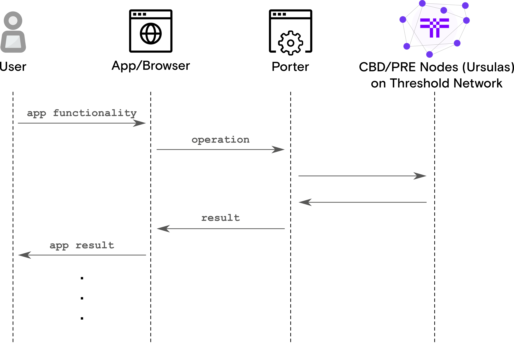

.. image:: https://codecov.io/gh/nucypher/nucypher-porter/branch/main/graph/badge.svg?token=8N55VR1TO1
 :target: https://codecov.io/gh/nucypher/nucypher-porter

Porter
======

Overview
--------
Porter can be described as the *“Infura for TACo”*. Porter is a
web-based service that performs TACo-based protocol operations for
applications.

Its goal is to simplify and abstract the complexities surrounding the
TACo protocol to negate the need for applications to interact with the protocol
directly. Porter introduces the TACo protocol to
cross-platform functionality, including web and mobile applications.

You can utilize any publicly available Porter to interface with the
Threshold Network. Alternatively, some application developers may choose to
operate their own.

Running a Porter Instance
-------------------------

By default, Porter runs on port ``9155``.

Security Considerations
***********************

-  **HTTPS:** To run the Porter service over HTTPS, it will require a
   TLS key and a TLS certificate.
-  **CORS:** Allowed origins for `Cross-Origin Resource Sharing
   (CORS) <https://en.wikipedia.org/wiki/Cross-origin_resource_sharing>`_
-  **Authentication:** Usage restriction via authentication protocols,
   e.g. basic authentication etc.

.. note::
    Managing a Porter instance on ``mainnet`` requires solid server
    administration skills. This includes understanding how to provision and
    secure servers, applying security best practices, and maintaining
    consistent system performance. Key competencies like network configuration,
    SSL/TLS encryption, and CORS, are also essential to ensure the
    secure and efficient operation of your Porter instance.

.. warning::

    By default, Porter runs over HTTP. However, Porter instances must be
    secured with a valid HTTPS certificate in order to be compatible with
    network applications.  A Porter instance running without SSL/TLS is not
    only insecure but also browser-based apps and websites will be
    unable to connect.

    To secure your Porter instance with HTTPS, use a reverse proxy
    like `Nginx <https://www.nginx.com/>`_ or
    `Apache <https://httpd.apache.org/docs/2.4/ssl/ssl_howto.html>`_ for SSL
    processing, and potentially `Let's Encrypt <https://letsencrypt.org/>`_
    for automated SSL certificate issuance and renewal. Additionally, consider
    using cloud-based services like AWS/Digital Ocean load balancers or
    Cloudflare for SSL termination and enhanced security.

Configurable Operation Timeouts
*******************************
Some Porter endpoints allow optional integer timeouts to be specified as a
parameter. However, to prevent DDOS attacks, timeouts are capped. By default
the ``/decrypt`` and ``/get_ursulas`` endpoints limit their timeouts at 15s. If
the optional timeout parameter is not provided or the provided timeout
parameter value is greater than the default timeout, the timeout used for the
operation will be the default timeout.

If modifying the default timeout values is desirable, they can be configured
via environment variables:

* ``PORTER_MAX_DECRYPTION_TIMEOUT`` for ``/decrypt`` operations
* ``PORTER_MAX_GET_URSULAS_TIMEOUT`` for ``/get_ursulas`` operations

Run via Docker
**************

#. Get the latest ``porter`` image:

   .. code:: bash

       $ docker pull nucypher/porter:latest

#. Run Porter HTTP Service on port 80

   .. code:: bash

       $ docker run -d --rm \
          --name porter \
          -v ~/.local/share/nucypher/:/root/.local/share/nucypher \
          -p 80:9155 \
          --restart=unless-stopped \
          nucypher/porter:latest \
          nucypher-porter run \
          --eth-endpoint <YOUR ETH WEB3 PROVIDER URI> \
          --polygon-endpoint <YOUR POLYGON WEB3 PROVIDER URI> \
          --domain <TACO DOMAIN>

   The command above is for illustrative purposes and can be modified as
   necessary.

#. Porter will be available on default port 80 (HTTP).

#. View Porter logs

   .. code:: bash

       $ docker logs -f porter

#. Stop Porter service

   .. code:: bash

       $ docker stop porter

Run via CLI
***********

Acquire the ``nucypher-porter`` code base, and install using pip. Either:

.. code:: console

    $ pip3 install .

OR

.. code:: console

    $ pip3 install -e .[dev]

For a full list of CLI options after installation ``nucypher-porter``, run:

.. code:: console

    $ nucypher-porter run --help

* Run Porter service via HTTP
.. code:: console

    $ nucypher-porter run --eth-endpoint <YOUR ETH WEB3 PROVIDER URI> --polygon-endpoint <YOUR POLYGON WEB3 PROVIDER URI> --domain <TACO DOMAIN>

     ______
    (_____ \           _
    _____) )__   ____| |_  ____  ____
    |  ____/ _ \ / ___)  _)/ _  )/ ___)
    | |   | |_| | |   | |_( (/ /| |
    |_|    \___/|_|    \___)____)_|

    the Pipe for TACo Application operations

    TACo Domain: <TACO DOMAIN>
    ETH Endpoint URI: ...
    Polygon Endpoint URI: ...
    Running Porter Web Controller at http://127.0.0.1:9155

API
---

Status Codes
************
All documented API endpoints use JSON and are REST-like.

Some common returned status codes you may encounter are:

- ``200 OK`` -- The request has succeeded.
- ``400 BAD REQUEST`` -- The server cannot or will not process the request due to something that is perceived to
  be a client error (e.g., malformed request syntax, invalid request message framing, or deceptive request routing).
- ``401 UNAUTHORIZED`` -- Authentication is required and the request has failed to provide valid authentication credentials.
- ``404 NOT FOUND`` -- Request could not be completed because requested resources could not be found.
- ``500 INTERNAL SERVER ERROR`` -- The server encountered an unexpected condition that prevented it from
  fulfilling the request.

Typically, you will want to ensure that any given response results in a 200 status code.
This indicates that the server successfully completed the call.

If a 400 status code is returned, double-check the request data being sent to the server. The text provided in the
error response should describe the nature of the problem.

If a 401 status code is returned, ensure that valid authentication credentials are being used in the request e.g. if
Basic authentication is enabled.

If a 500 status code, note the reason provided. If the error is ambiguous or unexpected, we'd like to
know about it! The text provided in the error response should describe the nature of the problem.

For any bugs/un expected errors, please file GitHub issues with contextual information about the sequence of steps that caused the error.

URL Query Parameters
********************
All parameters can be passed as either JSON data within the request or as query parameter strings in the URL.
Query parameters used within the URL will need to be URL encoded e.g. ``/`` in a base64 string becomes ``%2F`` etc.

For ``List`` data types to be passed via a URL query parameter, the value should be provided as a comma-delimited
String. For example, if a parameter is of type ``List[String]`` either a JSON list of strings can be provided e.g.

.. code:: bash

    curl -X GET <PORTER URI>/<ENDPOINT> \
        -H "Content-Type: application/json" \
        -d '{"parameter_with_list_of_values": ["value1", "value2", "value3"]}'

OR it can be provided via a URL query parameter

.. code:: bash

    curl -X GET <PORTER URI>/<ENDPOINT>?parameter_with_list_of_values=value1,value2,value3

More examples shown below.

.. important::

    If URL query parameters are used and the URL becomes too long, the request will fail. There is no official limit
    and it is dependent on the tool being used.

POST /decrypt
*****************
Use TACo nodes to decrypt data that was encrypted with associated conditions.

Parameters
^^^^^^^^^^
+-----------------------------------+----------------------+------------------------------------------------+
| **Parameter**                     | **Type**             | **Description**                                |
+===================================+======================+================================================+
| ``threshold``                     | Integer              | | Threshold of nodes needed to respond         |
|                                   |                      | | successfully.                                |
+-----------------------------------+----------------------+------------------------------------------------+
| ``encrypted_decryption_requests`` | Dict[String, String] | | Base64 encoded encrypted decryption requests |
|                                   |                      | | keyed by node staking provider address.      |
+-----------------------------------+----------------------+------------------------------------------------+
| ``timeout``                       | *(Optional)* int     | | The timeout for the operation. Default value |
|                                   |                      | | is 30s unless the Porter instance is         |
|                                   |                      | | configured to modify the default setting via |
|                                   |                      | | the ``PORTER_MAX_DECRYPTION_TIMEOUT`` env    |
|                                   |                      | | variable on startup. Timeouts provided that  |
|                                   |                      | | are greater than this max default value are  |
|                                   |                      | | capped at the default value                  |
+-----------------------------------+----------------------+------------------------------------------------+

Returns
^^^^^^^
The result of the decryption operations performed:

    * ``decryption_results`` - The list of results from the decryption operations performed; contains a mapping of
      Node staking provider address/decryption fragment pairs. The decryption fragments are base64 encoded.

Example Request
^^^^^^^^^^^^^^^
.. code:: bash

    curl -X POST <PORTER URI>/decrypt \
        -H "Content-Type: application/json" \
        -d '{"threshold":5,
             "encrypted_decryption_requests":{
                  "0x04aDC6465Efa53BBD096B2aD2E3dD7DB6EA9c3F4":"RVRScQACAACTAMQgwhlSChp/epwy4evVaXSy1MTn0IjTeH+KlEqHr18tOm/FAfMbyHGdQtnqB66KWQfoEDjs/zxIqIQYM/jFDldmfNIv1RmHxGYJrcXRfF22ewFeTlPEhWmO7T6m15o1c7uas81pzsekF7/WqtTHHuStL7EuQU8Y5VKryUAx86eg6He5lQTZhQx85ZSxiCbDyHd1m8LxT31rM0Mgk7ZDOnYwK/JyNMMRo1hC9/Cl3btEsn/YKnYL4owiUmnXUM2uh+oPJ2h+C/De0KG6cmLlGu9uJOzbAbOrBjB4hoY5p4W70ecqJU8zAvs3deEbuHaa9FE7CUdsq56ugf/vtA+bzdQxIalBCJQLaqSYB/OQl2SaN+WQ/Bp4sToqUWwsDTs9dm7qyFkffqynIyrjhs+fmYI6L3LNa3bXwrKnovR4pv8QTJ67vlyO6C4/jCSjZ2CEP6vv5dlwvyE+2Tots0nJzEoPK2baz2pi2a171f612ethXEApY8OhJCNpMSlEWAATZ741gnYl7mMvP3xwgevu0i+3YD5rTkEJlVh5rQrflIRqRmw4f6qdftcFVDcMipgGoess8qHmmNw7qkKVlQQqv2tzzUtHlenjQ/mtqwE3X1PdsoYnpR/ywUYr+8nGZ7xO6g9REz74dufuccm1+HK67zS58vBy4r1vx/SHj2h9ShR9y+Rakmn35MV1frpUSDZL3w7K+PeifKgF",
                  "0x18EC3906D608b2b0B0f240C84AdC6d28671a48ce":"RVRScQACAACTAMQgwhlSChp/epwy4evVaXSy1MTn0IjTeH+KlEqHr18tOm/FAfNu9h6h+nBMsSqFXAbjIzGrD5f2rmKN2pDqD6p+I7iJEu2+qi6Is5EveAVJsW/kkgPPSc5V7OzJUnB2ycOnRzs+Gl+vlzihwdDm64Lo5TMQuZAnW6l8O7lgcd7PO/8q4GfeH73LGaQUuhpDjkjZ1Jga7mASps3o+FxIsbMbUjHBK7FydJO0tvc9sS8tDFT5xPrLvKtr8Et+l3I2bguyfFwCuLw74yaV7Cqxx6x0pzhUeZ4BaAIgGyf1R7l2EPxeLaF+6F3yyUK1wy35BE6YfdPYh4J3Y4Tu3ccgIOORJrOQwypVrRgLy7nLzlJJuv5T+Ej7ZyFqOSevnUlccMTEHCvgRAWcq+tBO9hgTO7yNo25EoX/EUJJwZ+0S6g/kaPNkVT6jmpwdmKWULSqZ/2MRAuE4qvBhLFBbondCgnZHVYndwcefjB8OfLPeRkc5YRFkHQcxqySb1uPaoM0++3l9/cmXxotxv9TwksVoEHwWgEHGTEgcdlz9QEgryn9pISTPYGWv0/+A7tPXV88Z5owTYQprNzxgtCpyOiFhhA+H4NBZ2rSX01cNKjPzqGbB3LKWgNdbSp7HaG7BEkVSAMcCiX9xWMcfgnhCi8f3lbhGTIXJ4WvD81yIUdlPlBFsVAaLBisNUPauMphiwbCBnTRjTVaawBr",
                  "0xABbacaDabA000000000000000000000000000009":"RVRScQACAACTAMQgwhlSChp/epwy4evVaXSy1MTn0IjTeH+KlEqHr18tOm/FAfPFriRyxW2nCZaPCfU6je/sRhv1WOKi9NOUi46s4EKPxGpkqLMk6yLrn1+xhhlfQZ7rOZ/PmWTdtnMDPfRmRwOp976wVZm8xuo76DKcL5vI/m+x6KmOtQFQL2uNu0iCS0reZ9gP87/EvzP3G1aqgIGQQrQf5jAcdfXFCnseMDcZX/Do7ElRqBVoXxYT+jsyEcPTglfU2oWrQGuJs5kO5Lm3PJUI1zLWbmSrloGPELHzPHtGQ8t3XcToDrEiSaXXRU698ErCXE9TPVctuk26AYOTikAylfEsjkocmJn8w1op0C2ccDbS7zg889BLM18f17cfIU2CEiANkoJA7Bth/beDkM00icnaZ0ZhOcqaTV48+T2pEEW/FhNSkBG1LECIxUBiJLJJYj5FpO2S1O2MHlNEVFF2BQmmw24qzE2REpB1dSoRZU4HBBqeS4IDbekGoBZ3IbGCK1xoBQwEnAQPN0Eyi8vAqYNRmSRj77n+OPJybwdUpd9Yvh/UC0nhNz7GgaZTwtN1/7kn4IY8/8Q37lyhihOdaNJATaFpJEqqz4pRoHsI3FwCTbK7N4KQTXXnR8o7x28GxfC7sX+Ff8Ybvii1nRBm9N54k+Y9HM7ihGxpnEv2hs3GAk55XjuIqJ1DJlJVBAIJioABFG6e2q8ALqHWnxOO",
                  "0xAbbAcAdaBA000000000000000000000000000007":"RVRScQACAACTAMQgwhlSChp/epwy4evVaXSy1MTn0IjTeH+KlEqHr18tOm/FAfPr1njsR8BdPtJTcPxFUKatB5/PP0UgUKRY/hOKm0Btl/PKvlbMYQYeL2+4NJCRNev+RfZN1R8SVeJbLgZC2v8edwO0YqUWVqu4VU73VqcCn242Z/7zvwHIc7cFlLIIiZ8jboQonT49XUpvjQCRv2KlRRoR/dAs5gAVnxd/4TZNLWFh+HwQEptbh3rADbZlxptAT2rk4Lxtl4oLgSFCzvRRhptusdLEyI1a8Qn55AoeDtaARI5c7PU3TBdhK6zLJym850IM3cAAr+H1ChadRT3ntrji4ppO6umUQTpXVBSm0u4O37tWshGX/37ER+urs5D7JAdOS7bJT8o37eHZMWIeUFtxsakhowl4jUtaVayZKD64+RDDYC4UtUQVWpjhbc8x0hsLhKqqIo8EliyA97EQoLskRh4KK3aOmlAfNckQhuu8H6580vzAxLt5uVQtiVr3UbJpMqU3kj1GDe1ecTYl3NSvEhhy9M70MRttYu0JULvmv28spAZuIi05qtNTagSy32UvPMtob95THs7JOVN4BxlgqBEQTQF5Q4hKjfm1GTa01S86ZDXAO7ZpBHOHbzvOVgD/RLE6vQ/9UPvXClHI3DU0tbbpW080G04KvtN6SxMne0AmtO3Me9N3/UyGacKm1IrRR79mJb50novbESghDJET",
                  "0xB5Fa888B41F1A252757118F427Be483E1e0d611e":"RVRScQACAACTAMQgwhlSChp/epwy4evVaXSy1MTn0IjTeH+KlEqHr18tOm/FAfPUP8mf6pA6n4PW589wNPomu/GF30cnjrgelkReVE3HtIe+AaPoIG4xFS/JCKLORjwREMbaP901RIef8fAQIFRaX8dFrwYhSfG4BgG68gl4zFwQIJys2fiqmYd2qCXtcjulnj0mlCQ/xA94lTQ0g+TgB1s1pnbn6WYmNqFUsKfpGp7g+/cRMC/zpOG4AD+Ozyr9IN5XSAE3bO3G3Ui8pGA+fSsUGA+EQx/ab/IcwGbjw8U0eUIwGWLokCu5kpJ1UzN9fr/+0tKZZsX7fONV/dXrj5Fy56Lqbf1HrWv1RIpKNYUSKXn4QfKqv9OS6yOUW38zv0h2NFOnFQlGmgjIM4KD/6Ytvp3Ne5B+SDRIIRgN8kOT88fXs3CI9I0P/pRJanrCJ2KxoVnySHKX1BTxmLPh/NLQK0xCsUw7h5lawZmsJX7G8JdD1qJKUgQ2m9o5ZMWV9kc9kQmKg1pS2LV79g/VNtFVj7ad/P8XSANUvarGpXyEctojTUsXiD2QzTvZE8hrwmoFnVMHvp2RDg9aX36MZK7K9vhP/W55TPsYhZ+1I3/B9d47JYMGo6WseSN8oIJnlqk4LUp1vnYiIRE5yoUG1quK+XwEcgqWePAfRqF9W19f8AUZth4+E47t0GLUVA38GD8RdxhZu8bGzhffXLwQ3J/G",
                  "0xaBBACADABA000000000000000000000000000005":"RVRScQACAACTAMQgwhlSChp/epwy4evVaXSy1MTn0IjTeH+KlEqHr18tOm/FAfOyePokgnuuvse3eOxLCuJ6QBq6r799898Ib6mLhZ7RBHRtrdErimC2fXDIiVQ5UfxhLUpCMx20fBgGvzi9SZiKz0K06xrX1WvEVb9shK3PSh20mLG/PIwI108aI/jBJJsO5/rnCk0gUTarWY3+PQHnGbLagaaxJvdXtJ/8/C/RiL8ieNGOn19g8osdKTVxMNy4zZ4lMXW+C/VMBMQWPxR2n5VuMoFUrHidnHADxYMfv1/mdwHOK6AqNphX+hfmx0PxMt6kMipdOWHC15LqCy+wtlm1eMu5CuakC/DZqAPXX6fSxApIK5DD3zjWaRRFThDdwfZy3Q0I58l9D+NSUU59n1hgxO04e53BOU+AJ7X71iLEhgsdt36M7u4cm9s0l+r+F/CWlsf3UwBjJS0xGgOIfzHlpmsqHTADmphBx3eP6CZbIRBZ/JBDhCRyqxlfEonuYXg/mVXeBjunglu6roqGJ1p/AyPSMAlWnGcTNsoC07nR5hdNWL/fraZZcTAEOg043ZEZzKvqIZhZyvqCZ1dKtaChU8C9+ax9+UnI7SWS8dI1Lc2TTBVk3XLLqtMXZtbCKausve6sHS5Xm9t/YV5pY0WPfvOeFZ03NPQ0PlTv1JRqVj9VOCMxL7W43eEXOjj1cusd08XzBrWlhEVNZC5G8lxI",
                  "0xaBBAcadabA000000000000000000000000000008":"RVRScQACAACTAMQgwhlSChp/epwy4evVaXSy1MTn0IjTeH+KlEqHr18tOm/FAfPgCj9zBXVXdvc7ULeIUPEdxuTTt0dUpUajPVhFLyks20VAkv92h96ZRmVDLRdP41stCKbQwfmDxZphJSNl58A/tCPBwcr2xMjjDmDwxTmKtshdM1XX/t7PE2eFInMHASoSwYv6PMhFcFvQ7mKS+nQQldafGT/9i4cu4mGoOsY2KZhNd53NU2k6bQrFuinQP5Wr7EPw8l+pTtBPzUXxVH7iRBwVj4UVnzUMUxv4yFFnyPxJ95GXkgkPE3e+XMs+LpCc1i/iqgOi8Rnm3YmF8YYgT7sGM+5BqhFncYLoqz5JVVkwO0Ep6U3cVI6iidMFxWhAH1NiwUTGVwAiisaOHgy5jRS5BS/vqoWGNN7bmSbWtU7TBd8ahPGGybRejwofy8/1dUi8Vxu5hB9VhgLfIF4bXWwEIjUtRqgZRbE/q3wdyCnOmnz39Sf5QrSvS7haZ2ZK1WN94h28oCiHFG8PMdSA0TVCyBeJe2nx5WkKdOdaFfmozXx5A0xjlvTW+D5uqFnw8aAwWu1fIuY70Dabk9lOfARPOGa5QySMLtWLE47uH96BisHhHOXVNMUTmpwNbqqLyCgFhqpnRIbqAYIMdAhbD8XhhCEqWfNRIpZYbbPZu4eKWmLhLy7kKKy0/KZC2TVd9QP5f3n7pRjJE/Qu1X2iPoO5",
                  "0xaBbaCadaBA000000000000000000000000000006":"RVRScQACAACTAMQgwhlSChp/epwy4evVaXSy1MTn0IjTeH+KlEqHr18tOm/FAfOlQRtUlA1X52lcI5y6O+leZhH7BbIzawqMht+UBjjAYg9AdYGL8Az0kR5hwPzFFJ/qLYecUGZQm4Fbp4CIUoeJ/AsbPCUTw9VlceLlNGVxd+pe8Ej6hr76sCiiFpmo+mTvX3aKlj5WpJUiNEJCyZKTffBdK+kkQKLmb4xo4JPfmSHWr71KhYO5+L9Ctc4styA96fYopp31WHlcWlcYaNGAS8RCvsDK9GBvpxTad32se2+L0J2Zu9C0TjKnuRZ+mscGZxtgOkqH9p1fGchZFliwEzDHrcJhwS0tfqCPIwTveVgKIk/1uNlUAX81rkIR7vZCinIExQXfozUzqy1PotLntS1q4ZjKmOcI1GBbIEfcuB7ZvudeMf8+dqraEkgvjPR9oyUZ+YWZMYE0wlMVqVgwZFAGw7xFkRqbWUn6089LESJ55gqeskN+3PCq4yF6rdlfUrW2KC0KECV1nxmeZP+e9Wxze5wRu7LOgsoF3EKwcrRPtJi7xpSOCRQJFaDp+ZcNFYtSv78pxWaSClfjks5Tk20zbXXmjyPdPGvGdxBQfBxfY7ut5mRuKW4awY1mA+3KT0sJqgolIW4bDI5EP2Kvmvg6ynva5zLQhwiGQNCIi/9S4n51W+L0W8/6vkXeYehfcvRMtYpbtfxTDMhvHGzfJx+t"
             }}'

Example Response
^^^^^^^^^^^^^^^^
.. code::

    Status: 200 OK

.. code:: json

    {
       "result":{
          "decryption_results":{
             "encrypted_decryption_responses":{
                "0xaBbaCadaBA000000000000000000000000000006":"RVRScwACAACSAMUC0QOCuW22G1u9q8ultJf7GmknsSt3tgFbbDXH8wYzebij5wobdpUIQmO5AiEriFWAEzdZwYhdlEDdG8Av+gzVkZNYGmPdjUk0Q7C6VEJpMB0CXDZr0H3oqNnMOHzCAbwbmYimxw0Wb12xTtaPPh4GUNnTiSegI3Bp1Ug5F7LF97cBepi/WwxxX8yC2XiAGawwEtXV8/Ll4gEbhW1RK/pqq97qH1QQeXVL7MtryvgkhRKOOdjEJ2m/gaEQOlzt5ChM1BLOiR35tfVc+UABYB9jy/F5lMt84Ac31sAhJZzWGFfQV+JUgkJGN2isIUQukYgiHpCA1oQ99CJcve3mZSSpZLFdxrrpshNe+rPWVqZTs0C5Qh0cl98jvQZQumD567CscofLhKQJV4g4mkyFlv9eKNkqSEEcSx2bmTr8rGqEQFqIGcUJbCzPebgGXzHjrcH23l9jY0h53k1LY2IzYndOXqNv0Wf+cYMEPx4x1eDhkQucmypsGcAEjo4uFbXnFkk/kiHas+HtoommlAPWeyXmDfPEhVMPkU2P8lf7OuYnQpBrZF5d1nnIN9cXRWW2EHceiSmllRMkN4NnqWy5B/rJ5UudCDJaf3gbhEhV0VEzJAKRGbPE5kau2JyPSdPFLiYYIhRTy6Sw1XQVUe9v6sy1ykTmSav0TeO1NWph7SyZQGJotm5fPPSvSuFG5AoMc2zD8kPY2eBSNMncvCCu7L0pxyVPSMJyE80OEQEXA8W2kfSQKfbr8nLQf0D5H4nI7XuN2ecgpjWfglKlD8W8rlbdWQ2ydLQYSmeko8cXInOMHrOSckuWnpjw/92eWWnkXkiqTOhHtwNf39eDBbXCQGZDLZEPis9MP+yiuUaR88rftkRprNSXJW7cP3Q4FXvKI+xZuEOCWqiOuxokR6S2DRRt2neDNO8TP6HrjjAIrG+3LfvoH5j920DHn3SnhPRH3febMQw=",
                "0x40896f32bD685E6F5C74A5b6ab4d8c7953cbFA53":"RVRScwACAACSAMUC0ec0FnIRxE4p3kjRVzmuEMWZKlk9wADuNeeW4mJoI5GiS7G0/dL8ZIlkLv2BiQXNJAuY3IZTZvkT1ppFRrBK8s65OjzBWvS+Mmarf9nj6qJovkS8szLsMV8qKSwF5KIrHC0RUYHqTSiAL0azkie5VRevY/F9QiG9yX4FGg2wzaHUEv0e14m8bbk/+a+tpQRFkgX3psjModOEoxHSqbEm9oRkVgySj0KEaXjwyPhbGhGDMjoEHuE/t3dw9/3ykKRPonDyG28SEJlTe9rDKbfxqqCxUjd3bgmyFym0APcPyh8EeA9mdGa5PWcuxe0HT0ff2aGV518MUBfk+DQ3l784B7mSRkSqpwgO0vEldeiujihUU5BGDskBL5qzuoJNzC0Giy7YcbMRIgAFsFZ9CjBN5xj3bftJewzrE4JRMMtdskhUJiEJ4ii3gwEmhR3qRnA8lLb8425JnI8cCsV6TwPy+kjYiHDw2BSQw6cm84wz99rqLCZ51CeWgLvs/nph/EISPpMhdA5Gju7F3HZF+Vlx64WIQPz+r/WGLhWaHcTKDTLajPVTFKFtWQodcIl84KjIvRVGFtbpx4PsZtLNdBotfQSX8KGCvZ9Sr58Ccq54A0u1Y6JWjC7B2uOowqd/xepXqNR0FFLHGIk5YYe0uNmX5uJA16yTJs/VNu5kqdWr0dvFXafmMk5M4JSioRk90ERRFhQXtUks4HR49sRCA18r7Tk4xANDC3ePO+XJ1CnH4v49076N4DckKIcf7V23wFW3veS1mwMWPauhlk+xndnyNENl1N+d6cx1hAy5G+AlK2s35RKWdafQ3+f049qk6zDwXiU7h+7CpQEXxP1iK/EZzZDVuSAjRvhqzUTtUR+sAheVNGgIUbjXmgeu/3o2kTcNhOaMS6PT9Z1ogSzDap8DDl9ihE6sSPYAnexdhrtSr9aPGixD9MX4YaQQ2ovW5+gvao0=",
                "0xD27a0b270FBB5b090C5bBdD98e439EA992605436":"RVRScwACAACSAMUC0Y8NgrSrmQwHk4kjLqjEkyQg6A7OiGWDTuZH7U6LkApsw+cBJQTtI+TKJaWl1rOHGGfwoUEf7qJyBiNSRc/mGqMGX9C4Ufgbd+O7ld6P8zxbcFJKoirVyeXMZGz9jfMFsSBzjmSuZbtepPmcVcgOcouJaofNi6VfwwMJtjueMfM8M3f7W/cWZIPH+OXQFTw+tVrP1Tu0S1rU+SvHDLfnRf9cqhyEAZrhONdLUQMDOMzf1ksI3hsZV8LtDq0b1Ov3rshoqQzVgyeSUGP6l+GYTqdeS0fRhuGY071oDjKNssYQ/14JiyJsUEbolg6gG7onbPTjuoz0lLSTYUV+9rWdh2nTcj8gwk/ywKmSXA3s0449II5hZkKd6HH+5jTUvMP/ak/aCk6UWPTezV1a1jfhBnmDbxTxG9Ejjhiaa2iH1Uk6eGJ2t/r5N2e5nQxnIJyx6VYVS3FNMDOPT2DJaTpJxK0lP5bpLo2u/kxZNZALgahayb1TXKXVqe0XJMjLDehPeL75/dcNXCjwKMIet9HCjav8iOvsZoGkZPnd6oAIXq/O3GMEUzn3jgVyETOk03TjtnyoYDK9whP2C7Xa07+a5LNx4YofjFGdAE9zmqTI7Am9sttj5uCeFobEldYgv6mWFAWSCbnW+vYqAldGNRamH8ZUw/je1wmndFjBo0KPFNFypB7Nlygxu2luhgqkqttq5z1tq+HG9IRASh8VyoRdSlCFnmHtWavac4J7sWIfpBfIGXeTj96PXL1MmehTvPAukv/qQ2F304OHdeC/HUUT64ukfufqQtTeZ/m64kDC/pDOkXiAiy8hPnU87+fWKpl8kOTufRx7Qo2EHenjaJF+bOV76uhFmICyY7jTSkS8W6O78M2MQcSCPCqF1tcxz9I98zgUsh7hkHFWTE1AHB6eq+x5s32k2K5wdomzObUHSymhH5clhgibDilhULnSnTw8MYk=",
                "0xAbbAcAdaBA000000000000000000000000000007":"RVRScwACAACSAMUC0b9T7D+3J8vVFlHo1bbeGyZnrh50uRri0h4oO9XkFC3fCveLQM9F5vS/4BBEh3bk5S8MRszX1DMfHcDuOzMFw36bA3pd87pELVsd7IYwKsqyNb5JuMDskdShT5tQEaardEs8Hbwv2xFQeZpTdQxhAzZL/cOBrOTuq9JfB1LwvMEgGf/uvBRup2UxhYuYunNUB4gEiHHlbI1TO5AURJq7R2PKNV4dmggv8X3kUdvvK3hz0IaIBvswoZhXSu3wCzVvM9wJrq6vuVEnhvh3TbcaS6kM1Q8n2cmjc13eiG/OmkAWiAbXz7wLewVTV9nHP7qZvpqoy/hJiOsl5pZ1wls42DuH5YUu1Mp2pAofSvxLTl1xR+1y4gUhOUsoX+vnjEvb5ZftK4/720btc+T9giQ8gptnJKR6QKLMZOAaU17Q2cVKRHd4kAdF90/afQc2yVmjjmiC6zNKUaJJIBDO1J63C7afBMXxyh0tQ1n92w3YrUC27so/dlCUfqe4PL6HjGzOa/Y5El7T4tM0P+wEbGs14XM+cbMl7Ub58mFtTXR0nlOfFHtEDG+QnywTAXxXCw3jR1PiVZ6PWKtNIZeKMvVO8fXI6YFRuYNoHhtA9ogft2qo3/YD/QeCegrPI9brqbhXGrbavyaKV1qqUwPCOKLmfDIwvcucr7pKGc9vgrhiQp8lltAqslu8pa1DBG0pducVAYReH9WwD+dJEjmEh5LHLm/4ddR9KVXxn1bpGTkpw9Zp5hhBADzs2XCZmhGmSrb/H53u9mBIXxvaH9tBJeNSo3TTcds6bvVnoN70qYwe72UZVunZh2ThwldZLNuQLlbbDC5xF695eL6GuNgmdYQqVPq77BSfCGEXvFKbtd3ecNYmqNtsf+Yo8014SYKw5qBGSB12szH0w8MEXu5cel+4PcDApi/z2TXhgSzH+DIcLdHlBRIY2D/sIw98wlOW6gt/3lw=",
                "0xaBBAcadabA000000000000000000000000000008":"RVRScwACAACSAMUC0Qqm6cDZHHBJgK86+MehwqBFWz4guKcJMFhX/RjrpwH7HR0Z0iLTjLxevluC5PnyuqDJFysvLsliulKIDYlWi5ryFxpYP533QQtLfoaAUXd9ypm/yzlg4VkRHpr6cRTBYxjlLYCpUsTqPNOnbm1YWT/UnIBtzPAoHDkZLXYX+yKbuMjsgs66gPfOheMIZAjcLyNby9kSqWBYxejDm0IyqJmh5JxHSnsmpCpQcexV0300KQ01fPHjuxo5C29IK7NzlVW9gSQtCm7jL1lEitvlKIghpsA7lRWZ1atDFT9AqbFBaHH42knhdSaYD10NmW6eL27L0Is69ydaihZnlv70DezQKEVJsXVQltwkFovfbJVWBWvuURhiOHavnJ9mqJ610VGxPNMiACnhvWK3L6zsdO/CuEdh070QtCMUH4zin5TYI/dbc9Zy1yBTzUhAE0xHRLI4H4Rs9w6Vw1vzE+VndCa5Ey0WVD6Bx+/0/CGkSc3j9/lbsxRMDswMjWIa2J7RhP5/FzwiBWTz7WSsOq/IT71m2578uKSsxQxzdqFgrqCW6Pm/5OMigN/e/R1SkyH2u8gJG7gwzkTJqsUQl54Y/GRk3LS3Wco+dSIr/EnwW5EwDZ2P0ADkRcdDjQjub7Ao0Ut40p/m2noiJKhK2+0JO7c0aMsKP7+xNS5Hc3m1nGpcz2AvM7s0HWRX54U3brKSZ6P66NcoHHxeP60B87ephPeSfyAkK9+m7l7xpahmJy7bJAv5vkAJcYtOcJvNO6Pk3S83qzYjKyKKf8MLZSP2REp/mqs98iIw6C2cNJSZ822zN+ifPY3WQ0yWpweEU1CSMMfgepuQCVAxxC08k5Xfx8SV4Shw1ZgDcgcKVv5vJmb1Pcfoe4fkr8805IXEY1pd/UHOJYAEK1HygQH0o1QtgHQxrGr1lCbUE3nGQZYwQj15n+Yo3sbhyHsmUp+bP5looDg="
             },
             "errors":{
             }
          }
       },
       "version": "3.9.0"
    }

.. note::

    Only a threshold of responses are returned if the request is successful.

POST /sign
*****************
Use TACo nodes to sign data based on signing conditions defined in contract.

Parameters
^^^^^^^^^^
+-----------------------------------+----------------------+------------------------------------------------+
| **Parameter**                     | **Type**             | **Description**                                |
+===================================+======================+================================================+
| ``threshold``                     | Integer              | | Threshold of nodes needed to respond         |
|                                   |                      | | successfully.                                |
+-----------------------------------+----------------------+------------------------------------------------+
| ``encrypted_signing_requests``    | Dict[String, String] | | Base64 encoded encrypted signing requests    |
|                                   |                      | | keyed by node staking provider address.      |
+-----------------------------------+----------------------+------------------------------------------------+
| ``timeout``                       | *(Optional)* int     | | The timeout for the operation. Default value |
|                                   |                      | | is 30s unless the Porter instance is         |
|                                   |                      | | configured to modify the default setting via |
|                                   |                      | | the ``PORTER_MAX_SIGNING_TIMEOUT`` env       |
|                                   |                      | | variable on startup. Timeouts provided that  |
|                                   |                      | | are greater than this max default value are  |
|                                   |                      | | capped at the default value                  |
+-----------------------------------+----------------------+------------------------------------------------+

Returns
^^^^^^^
The result of the signing operations performed:

    * ``signing_results`` - The list of signature responses from the signing operations performed; contains a mapping of
      Node staking provider address/signing response pairs. The signing responses are base64 encoded.

Example Request
^^^^^^^^^^^^^^^
.. code:: bash

    curl -X POST <PORTER URI>/decrypt \
        -H "Content-Type: application/json" \
        -d '{"threshold":5,
             "encrypted_signing_requests":{
                "0x90F79bf6EB2c4f870365E785982E1f101E93b906":"RVRTUgABAACTAMQg16PSAaq1lF8MQgdlgKatzBlLf1ckFWGHRnX3Vh8lsyfEwYQINwYW22D1N9FaVVNd6ZLKExoLDJhgUifwQIW878vbpnf7eOc0+qzv8mubcSnXBn/VTXAI0x5reGdzW+1/hoEqPU9622DTEf8+Vl0P5gaXsQJbe3oPTtldLMHLsJIRa/vLeZpjb0/HNgmQzjS6TSgQLQOyKHR7yTr8BGUQmRGrcYR3jZ168A9a1070/ycteKMeqikMyfqFlWsyZCDFNcm4ugcNT5xSx8BKFNqetTJZmXWUZT9PE/tBcpUy8aPcOfA=",
                "0x15d34AAf54267DB7D7c367839AAf71A00a2C6A65":"RVRTUgABAACTAMQg16PSAaq1lF8MQgdlgKatzBlLf1ckFWGHRnX3Vh8lsyfEwbhRzoBN++bXt3kywoIvs4/LEzEU0d2kacaE1vwLUuxc1XPNs8rGNFxxSin0HQ55MH/GY9piKK2WyFk0TLA19NRmCNrgvyc4dex+Eu+x2PLxaU5bQZTFHZms/IsSoxSXfEv1zwgdrS/OVFwSNnvmqKpVelvi2ynhrjHZM5E7XrtyonLUZGBAXjYfjoVnihnDXZB547KZ9TiNK07QvfzW0aev+GgeIPa40aueFuim315SgBFbjGzGv0s+Fh4rYcMewis=",
                "0x9965507D1a55bcC2695C58ba16FB37d819B0A4dc":"RVRTUgABAACTAMQg16PSAaq1lF8MQgdlgKatzBlLf1ckFWGHRnX3Vh8lsyfEwRJ0yE75iEkdOd17RCMIcbqwkEHFYx2JRvMelZQ4hGmB2sfYs4/tEBIPZkw0OxDJhx9b8kc1n488BsRjz59uOHk6TkpFIVOeiJxv/WUlyYRMtkxCkVjWuzpIOECmJzbIsDpZrIOeoTy2F/iKuKWNqCSdmcNRzkWwsF725AIYM08SmKveJxNIYR7TYo3fBBi916zf2BbWtLmheud2e6i+FmyX4Lt2lJsGP1hc1Ar5ldXRxj7kRVA8Qpe4Sr73PVj2aTE=",
                "0x976EA74026E726554dB657fA54763abd0C3a0aa9":"RVRTUgABAACTAMQg16PSAaq1lF8MQgdlgKatzBlLf1ckFWGHRnX3Vh8lsyfEwWGp6oqsO5jtFScdVBly6Od0D7xXzAOyQVk7adaQ6Cvy6Y+3BkLmmW8GHvzsJPJfLuQu58k+QbA2JDzJGkMRYqUWTJsSCr1gYiqq2CMsnBhMyH7dOxVMw3ti0V6FakuvSOIL5+X/z8YdAS0Y3NFdeVtKOhTuHknjRRTL8DZvT/WkSVBIGpk/6ZBOVy+QQ+I/jtgLK4aIl+rvy+pKtVe0SKgGTs3k1nRVZJ/2GvAYY+0XD9dprqVfrXlWsl7XxFrLd4g=",
                "0x14dC79964da2C08b23698B3D3cc7Ca32193d9955":"RVRTUgABAACTAMQg16PSAaq1lF8MQgdlgKatzBlLf1ckFWGHRnX3Vh8lsyfEwczaWSOBgQGl2RiZQHIwnsSC4sSEFME8EyIRdM7pYJVrI7zTA3DiR/zoxAyLi0FvtlKK4yvpHh786e1ygwzH2rYS7If3uUk0NE46TfD8/N2OMENawh177LIOA5dS0qnlUBolgyuGdDFMiyu4hJn2PTj6IjZUsgOZXEjyL2fjbEoAqbzAgstOduHV8xeJylCQIqS4+zpslbsO2bwHS2QP8/bs53FTIftD9QzaNsBoAQRevtne2nxTZh20tiYiLrtsdtA=",
                "0x23618e81E3f5cdF7f54C3d65f7FBc0aBf5B21E8f":"RVRTUgABAACTAMQg16PSAaq1lF8MQgdlgKatzBlLf1ckFWGHRnX3Vh8lsyfEwf8nRdTw4NyKMMYayuxiztCfMQfwXgwcSTAdjr34DdGG9GnMpf91KXyVPb1ih1iVkbtR1rKlMrliftLXLdDKQqzxen4KMu+7m2JuTUzsIWNHQ5rx+23UxFDEM0sridQtM8BdI+WjrRMdxu2ZMgAUJMGSr5b9/EsfRTvVU+TCl+2F55lHG97ZlW/pj9zrVtP/nkcF0CIALyClIM1QgwtDsVlefjk6W0nj+GOVA13OlH5nyGx5z8fin7QqOwV4RsXDjwk=",
                "0xa0Ee7A142d267C1f36714E4a8F75612F20a79720":"RVRTUgABAACTAMQg16PSAaq1lF8MQgdlgKatzBlLf1ckFWGHRnX3Vh8lsyfEwY3Iu6cELTjY3LKRzRBHIQ4iMvcb+9dbQ0J9JpxP5yHoQMYVFx8HuLx9ZGkJRSUhy/TNmF1A0VH/L08Q4QTZVQmix+McjMLYtNAwzOlmvATd1BmIY2F8jbdFdAevzKb9lTgadEOSb9YYTDh+WkHGP7zC06MJ3VSrILFkMIDYk6wTh4lnumiQXpmVqnu6YAOR1OPhZLxTe2TT7f1qKevscMuaTeL+5utq6ZjIvqg58EyD+QtwePsReaEU+H6KwUl68dU=",
                "0x09DB0a93B389bEF724429898f539AEB7ac2Dd55f":"RVRTUgABAACTAMQg16PSAaq1lF8MQgdlgKatzBlLf1ckFWGHRnX3Vh8lsyfEwTirWpSgenrmrLwzMzBP54c5MfTL8E9nBjVL5DagjWeqtpU21YYwai+Im+23N7XU7LB1oHcGDg9l3B879L8MghJGQQOqTlhxqjzdQX9YDjRKKXaWm0mrArUcz0ubmifgcM4h6it48itoFmU+RJ9FmJSX/5zFGXbBI6NIMNQT35AGkaXv2lYXg1TVLBpdI9WZz7f14uIVzVt9QL5t2xbIBE5HofjmNbVCutedev/585b511x2zEe7rXzGVcguEOehkS4="
            }}'

Example Response
^^^^^^^^^^^^^^^^
.. code::

    Status: 200 OK

.. code:: json

    {
       "result":{
          "signing_results":{
             "encrypted_signature_responses":{
                "0x15d34AAf54267DB7D7c367839AAf71A00a2C6A65":"RVRSZQABAACRxK+NtI8o+DvYN9iB3jctKdwn8YYqFBOS4kaYW9LC6kCZEpyD/QWtI/Rv0e2WxtFpANaC107iJ7g4r2++nNOQZHF4g/3WgoJHiiGcdzJMQD3lhKCtIAlDLDTP7zTcDNgnOwi0hDjyEIut80RbZHQii7r9CSCPjmEzSNNwSIT2rc25xhwS9USxik7IAskiBUo+1pkFPze3qzYDUOrRHX1ka9xbaDO/c27AgZaRWoKjY7Vx",
                "0x90F79bf6EB2c4f870365E785982E1f101E93b906":"RVRSZQABAACRxK9OjiIoD20VlZWs5P+vSYzmsbY5UgSZTp9e5ulzfZXm2XFU52ZSSj9IknoiNlcDyxtl65ekuwYpk5p5N3Wx91bW2389CGFMIlg1Jgw2PDlG+1e/desmKxVpuZj0bn0KgWk6xErnBfdJV2ucjZiCoE8ewhCLxH72EHyI0YJGg89E+NWz1yD+kIu2MPyvgS2JMkdUOnbR0NBMoz/WXt/i6p6iK3CZRCJgsewXDgUIHttN",
                "0x23618e81E3f5cdF7f54C3d65f7FBc0aBf5B21E8f":"RVRSZQABAACRxK9W4ser6pc5LJzIZjISpx7So42w0EWLBj0PdcUypi97i5ZenUAlgpn5A11kqrijb1pnVgiL4mktswkx8fNmUVvRxmFOTEhBFSRE88RkpsG7A+MdDM91s8m+Z5Bb4r1jbUkVglpKVmW3a5tsmC8cP4Q4G5seMnxKSBau72n96MXgbEtTi66KrXePnEsqm6kviNYO7VcINYXLXmdlR0TrZnYgIcBZC8USNjntPcjb9mjl",
                "0x14dC79964da2C08b23698B3D3cc7Ca32193d9955":"RVRSZQABAACRxK/zGPsbOHgigfLKokPs2htPlBuGwWjjcqqS66Rsu3l+bVE8uh+ipe/vcCEaUrdi6ninEbC0730mTJBFDwewNjquXRH/tvhgSoMxugkvZNPxUYQg6hDDXlEXQrx3kAYuFiSTGG7PehpNL3B327wM6zS5DvPkYcpwdy5hPg5QFfUVhmNJ//G4IvWcfK4BFfxiMwA/3i0E0zfOknIw8sijd5+Swr95svbkWqlPNcDutNOR",
                "0xa0Ee7A142d267C1f36714E4a8F75612F20a79720":"RVRSZQABAACRxK+Ntoxfz+7NO+JR7dKy4L/LvVz/zkncqUOraDG635bAb7saVUT/mBQuOMfkYmhIIRdXgD/9SYYGfzMD3SkgypLnyg4riUcFOF/qJ5aCpD/6TxGko8wake1P8hywbdjNhG38uTyrm7ox5smahCEA5xzzrjsVfFxj5oK4o1w/M56SzxcF6zIX9KgqNKDrTYKD+/tTxmHwhp+zgAF2o5soTdXwyPXCW6RP9ymuC0vwKArZ"
             },
             "errors":{
             }
          }
       },
       "version": "3.9.0"
    }

.. note::

    Only a threshold of responses are returned if the request is successful.

GET /get_ursulas
****************
Sample available TACo nodes (Ursulas). Returns a list of TACo node staking provider
and associated information.

Parameters
^^^^^^^^^^
+----------------------------------+------------------+------------------------------------------------+
| **Parameter**                    | **Type**         | **Description**                                |
+==================================+==================+================================================+
| ``quantity``                     | Integer          | Number of total TACo nodes to return.          |
+----------------------------------+------------------+------------------------------------------------+
| ``include_ursulas`` *(Optional)* | List[String]     | | List of Ursula checksum addresses to         |
|                                  |                  | | give preference to. If any of these Ursulas  |
|                                  |                  | | are unavailable, they will not be included   |
|                                  |                  | | in result.                                   |
+----------------------------------+------------------+------------------------------------------------+
| ``exclude_ursulas`` *(Optional)* | List[String]     | | List of Ursula checksum addresses to not     |
|                                  |                  | | include in the result.                       |
+----------------------------------+------------------+------------------------------------------------+
| ``timeout``                      | *(Optional)* int | | The timeout for the operation. Default value |
|                                  |                  | | is 15s unless the Porter instance is         |
|                                  |                  | | configured to modify the default setting via |
|                                  |                  | | the ``PORTER_MAX_GET_URSULAS_TIMEOUT`` env   |
|                                  |                  | | variable on startup. Timeouts provided that  |
|                                  |                  | | are greater than this max default value are  |
|                                  |                  | | capped at the default value                  |
+----------------------------------+------------------+------------------------------------------------+
| ``min_version``                  | *(Optional)*     | | Minimum acceptable version of Ursula.        |
|                                  | VersionString    | |                                              |
+----------------------------------+------------------+------------------------------------------------+

Returns
^^^^^^^
List of Ursulas with associated information:

    * ``encrypting_key`` - Ursula's encrypting key encoded as hex
    * ``checksum_address`` - Ursula's checksum address
    * ``uri`` - Ursula's URI

Example Request
^^^^^^^^^^^^^^^
.. code:: bash

    curl -X GET <PORTER URI>/get_ursulas \
        -H "Content-Type: application/json" \
        -d '{"quantity": 5,
             "include_ursulas": ["0xB04FcDF9327f65AB0107Ea95b78BB200C07FA752"],
             "exclude_ursulas": ["0x5cF1703A1c99A4b42Eb056535840e93118177232", "0x9919C9f5CbBAA42CB3bEA153E14E16F85fEA5b5D"]}'

OR

.. code:: bash

    curl -X GET "<PORTER URI>/get_ursulas?quantity=5&include_ursulas=0xB04FcDF9327f65AB0107Ea95b78BB200C07FA752&exclude_ursulas=0x5cF1703A1c99A4b42Eb056535840e93118177232,0x9919C9f5CbBAA42CB3bEA153E14E16F85fEA5b5D"

Example Response
^^^^^^^^^^^^^^^^
.. code::

    Status: 200 OK

.. code:: json

    {
       "result": {
          "ursulas": [
             {
                "encrypting_key": "025a335eca37edce8191d43c156e7bc6b451b21e5258759966bbfe0e6ce44543cb",
                "checksum_address": "0x5cF1703A1c99A4b42Eb056535840e93118177232",
                "uri": "https://3.236.144.36:9151"
             },
             {
                "encrypting_key": "02b0a0099ee180b531b4937bd7446972296447b2479ca6259cb6357ed98b90da3a",
                "checksum_address": "0x7fff551249D223f723557a96a0e1a469C79cC934",
                "uri": "https://54.218.83.166:9151"
             },
             {
                "encrypting_key": "02761c765e2f101df39a5f680f3943d0d993ef9576de8a3e0e5fbc040d6f8c15a5",
                "checksum_address": "0x9C7C824239D3159327024459Ad69bB215859Bd25",
                "uri": "https://92.53.84.156:9151"
             },
             {
                "encrypting_key": "0258b7c79fe73f3499de91dd5a5341387184035d0555b10e6ac762d211a39684c0",
                "checksum_address": "0x9919C9f5CbBAA42CB3bEA153E14E16F85fEA5b5D",
                "uri": "https://3.36.66.164:9151"
             },
             {
                "encrypting_key": "02e43a623c24db4f62565f82b6081044c1968277edfdca494a81c8fd0826e0adf6",
                "checksum_address": "0xfBeb3368735B3F0A65d1F1E02bf1d188bb5F5BE6",
                "uri": "https://128.199.124.254:9151"
             }
          ]
       },
       "version": "3.9.0"
    }

PRE
***

POST /retrieve_cfrags
^^^^^^^^^^^^^^^^^^^^^
Get data proxy re-encrypted by TACo nodes (Ursulas).

Parameters
++++++++++
+-------------------------------------------+---------------+----------------------------------------+
| **Parameter**                             | **Type**      | **Description**                        |
+===========================================+===============+========================================+
| ``treasure_map``                          | String        | | Unencrypted treasure map bytes       |
|                                           |               | | encoded as base64.                   |
+-------------------------------------------+---------------+----------------------------------------+
| ``retrieval_kits``                        | List[String]  | | List of retrieval kit bytes encoded  |
|                                           |               | | as base64.                           |
+-------------------------------------------+---------------+----------------------------------------+
| ``alice_verifying_key``                   | String        | Alice's verifying key encoded as hex.  |
+-------------------------------------------+---------------+----------------------------------------+
| ``bob_encrypting_key``                    | String        | Bob's encrypting key encoded as hex.   |
+-------------------------------------------+---------------+----------------------------------------+
| ``bob_verifying_key``                     | String        | Bob's verifying key encoded as hex.    |
+-------------------------------------------+---------------+----------------------------------------+
| ``context`` *(Optional)*                  | String        | | Associated JSON dictionary required  |
|                                           |               | | during re-encryption e.g. data to    |
|                                           |               | | satisfy re-encryption conditions.    |
+-------------------------------------------+---------------+----------------------------------------+

    * A single *retrieval kit* is an encapsulation of the information necessary to obtain cfrags from TACo nodes.
      It contains a capsule and the checksum addresses of the Ursulas from which the requester has
      already received cfrags, i.e. the Ursulas in the treasure map to skip.

      The format of a *retrieval kit* is:

      * .. code::

            base64(<capsule bytes>)

        if no cfrags were obtained from Ursulas in previous ``/retrieve_cfrags`` calls

      OR

      * .. code::

            base64(<capsule bytes><bytes of ursula_1 checksum address><bytes of ursula_2 checksum address>...)

        if some cfrags were already obtained from a subset of Ursulas for a *retrieval kit* in a
        previous ``/retrieve_cfrags`` call; for example, retrying after receiving less than a threshold of cfrags
        because some Ursulas may have experienced a blip in connectivity. This is an optional optimization that provides
        retry functionality that skips previously successful reencryption operations.

    * A *context* is an associated JSON dictionary of data required during re-encryption. One such example is when a condition for re-encryption
      requires proof of ownership of a wallet address; the *context* is used to provide the data and signature required for the proof.

Returns
+++++++
The result of the re-encryption operations performed:

    * ``retrieval_results`` - The list of results from the re-encryption operations performed; contains a mapping of
      Ursula checksum address/cfrag pairs. The cfrags are base64 encoded. The list of results corresponds to the order
      of the ``retrieval_kits`` list provided. If there were issues obtaining cfrags for a particular
      *retrieval kit*, the corresponding list of cfrags could be empty or less than the expected threshold.

Example Request
+++++++++++++++
.. code:: bash

    curl -X POST <PORTER URI>/retrieve_cfrags \
        -H "Content-Type: application/json" \
        -d '{"treasure_map": "ivOS2/MarBpkLAksM0O+pgLUHAV/0ceIBarBKwqUpAXARhpvuwAAAm0DoDAtioScWJSHWNGzQd9pMGW2dRF4IvJX/ExALF6AcLICLCBP+tte8QR4l0GLNy3YwK4oO8f8Ht0Ij+v0feWWwgeo3R7FVeC4ExDuYvgdsV6jCP3vqZnLphIPk8LQeo1XVAABAtM4mGTp5yBq4dGDAbvWetjgvfJXswhcmqE+lDj/kTPyAAAB5H0rD40N1u5Ct455sh4SicbHTGsXcRSt/adeHVl3zylNpWDsFbeon7VI5fGGmWLAKmCJ5ARU1Mgfwg0pfsXDgHTky6XOeXnNw630z9muBE4NMUiESOQm/RAsphMR/DEIMRaCgjhaE2diVdVAm15JjRXV9JN5gAp58Y1ecPcWR2lMcgAMHBFMX60bpbgjySha94Hwb0kR2SKIFkPQnuMljoQxutTDAyh55eE2sHf9ZOAVZkpKQu8NkaWy7adx/1QefezNbngX9c2yYml133Al4oGrLWYA3fnbod2Y6F1oeG5As5ZIW/O8k7Rf+3i9a+DS1i+KbgETHQGxOkQSpNPUmwJjtzDJQ1xFMmKkxgwUtXenfyrzDDPU6EQloWK2PmyTD/hSKHLpkLyzYp95gadzDiS8RlOnNw/uP8vfMPSrXYGZSKXvHvlrQxKOjnF7FrheauwwRPjM0yYTftPs3jNkZwCTl+Ewn6NdLur927SeGyAB3gHCjHenje+3hU1jsn/mwfwLJwSMT7V0rbXV6I0NYhjQy2Ajj+7ev/NSvRdeneeYTU3iHoO6nIhWHBLVExWafu59B6hhsm261kvXw718eiUcL+1X1eZ5WApplCuXGQV7L6DZxlQPanRJy7BZZQmFwEUoMCnx9mGbOKmNbeCADx3vwKY5nrbTDAAAAm0Cccv5a3jS2QiICCzCyA0Ot3U7VT1F3d+B3cHcmv8DaCwDODb8IadnsiVK+dfbPLn3ne+lm8d9yqhh6bLi6KNDb6yiWrjWnd4Irnnh3amMwik00vdyQKYvdsaSEJqtVLmtcQABAtM4mGTp5yBq4dGDAbvWetjgvfJXswhcmqE+lDj/kTPyAAAB5Do/eww+G709VPQwkxd0tRFyJh97Wcb5uSGs+4fK9O+5CTf5rDQSO3ueWLRF4ytRzd3QjK6+8FlXsJQM5n5pGLUNNWpUlimk2MmPaLehC9uGBfQzoTfQof+U8CBXkTTnRi0IeAYMq8eiuEnNR/oOJjpjuwgZH4gue/sSDF8FyhFU4SwF/WdjLg0FgmZzRlqABNXeE8vOofydEMYgUMPd8qxjimAGhkYlBUNjlme4BUdA2AqndMttpc3y9ILTobaGSnjgWfq9Ztw/n72scPI11T+YMaaXd33dacNPx+pVzcgqi358PT8WQ6U3n+1be8mhF8VGEO7/5zLFHECRCv06erER8ChTZvr4rb8Y0xRCz/patllLqvWZkGSmotmsi9qAptgG/XkozOZIqmBuM2AuQTwaePyuJzelc5xD51OlkQRahV6+ok3CokckwtOXtC6dzq4dmh03Uj5ZeKj8IgITDPN6jCf5TwLmXSuEGl5W/xmrEUeNlrthlJm7Cdd1NpLn3RZNCgSS4+Pw9cpY6fj/mF8yR0erf9Tkrxr7FXzSe/UWkfeB3aQPulP4U3nM7vJIz9DBcJxtdozfqHchZ/K+VnaW/7IlNhvu3Cwk+N3D9sUwf/uHQuE/QSsYZ0fjUCnB1UgJMjho5Sd4CHLNoCFroNj71YtnpdXjUQAAAm0D5ITdM1U28+6/LU++Jw/UTMOefScVULkEyaojkyJK574Dc96zie3HtMN0ahALfOg5yn2z2zZpwqsLk9mpT23GD8AYR55RcvLHGIjJTubtuMINy7ZBgbZmisPDt5DvHVKj1wABAtM4mGTp5yBq4dGDAbvWetjgvfJXswhcmqE+lDj/kTPyAAAB5B9Wn5rfJ8LS81DIkZj6By39KZPYLoNSpR+VEZsLaSEo/HTMG43Q/gG/YjZMQHBEZwleE1H35P3EuDlWOriEQxveH7ihmHVSDfj8R+6xo/263QCLqtg9djSFPW7h6QRx5JBM+WABcmIZQrAvMDe1q7F8VOGRDMf8tW/7sySMFn9pQ7735kasw8iNsGPX9gVNcncSuh8hmgWGzwciUU/Y5SYmQvl0Oc15G5/kFhIA9nDVfZR4sMBRB9ApYbnNYsxtH12wWhTo04hPEGfzsqKK10muLy+qpo3VBhX24HPTBAvYm68f0UVD+a0cZWmgYKypmMqApJ87RnPvXbE3rmKepJM8u02O4X1OBlfDZBrTsbCbMxeniS6bzE6VPE62jOW6GIuyV6+NQS3PZTuTWG/p7T5n2EC/Pf/CvGLq41gQDU9VT2aCbHkbr9C0klVJfUwqdE/51zLmcY8wpx3P+OS+lrIjxQzOpWSKQfsNyt1DhKpKb5Y1wWrUGm6s0sBEG7FQK2SmWMhpjB36ZRdmtQ8/mvh20KELR6W+ocGosR20TXdGINzJEnobbTkkGNz2sqzePvL7Ql5Utc/GCaZYC2yIvJEGBOSBVtKvwqTOaMOFTaCIx4R5f3X17umkMD1YCvir39cREkU=",
             "retrieval_kits": ["gANDYgMKitDPd/QttLGy+s7Oacnm8pfbl3Qs2UD3IS1d9wF3awJsXnjFq7OkRQE45DV4+Ma2lDSJ5SeKEBqJK5GdPMB6CRwJ1hX7Y5SYgzpZtr/Z5/S3DHgVKn+8fWX92FaqEXIGcQBjYnVpbHRpbnMKc2V0CnEBXXEChXEDUnEEhnEFLg=="],
             "alice_verifying_key": "02d3389864e9e7206ae1d18301bbd67ad8e0bdf257b3085c9aa13e9438ff9133f2",
             "bob_encrypting_key": "03d41cb7aa2df98cb9fb1591b5556363862a367faae6d0e4874a860321141788cb",
             "bob_verifying_key": "039c19e5d44b016af126d89488c4ae5599e0fde9ea30047754d1fe173d05eee468",
             "policy_encrypting_key": "02cdb2cec70b568c0624b72450c2043836aa831b06b196a50db461e87acddb791e"}'

Example Response
++++++++++++++++
.. code::

    Status: 200 OK

.. code:: json

    {
       "result": {
          "retrieval_results": [
             {
                "cfrags": {
                   "0xd41c057fd1c78805AAC12B0A94a405c0461A6FBb": "Alvyx0r4IXvOWppw8jzbdx/8lIhL36ZAhbvNcTfo4KC6AqUxu6iP9gOVSaiehZAAQ89ho9MIGyDYdJIjg/dRkR1DuNX9qLnhAsg+qJvGcPpEXHNG0L2WHxe+AUNqtOSnwiEDegcnRTgUFyR4gfs6/M49/t8iXuXJcT6Szcwtx2JlZtACpa4KPLa5hFgI67rkiZQTqzn/aLPEzdD1zhhUyaHpJXoDfXLdpQmyEl8aI7ZOsBLh6PtPlx86/cvU0NOsR8wIoYUDe7BiAijbjo4VtcYrfvzu9CWRiWb0TQQJO6v47am/RPUD6NTr5+S/m+EvGK22L7XWtMHw7X2M380i4z2X1jxeYZaLmtuJJLAQL61kEIFv/1afCVDe+odbZ0Wivq3EiQzd0UcYRcvhIyGJdBksGv4GjfXSNNl6OCn1ny1Cn056juxGQs3yxzQZvfEN0UAOsI5IcTvOh3/kBNGfJGH+Qfv/CKc=",
                   "0x68E527780872cda0216Ba0d8fBD58b67a5D5e351": "AvGBNjTE1WrgQLkDP0ViipGoSjlaq0Plge6szUOasYsnAnB7Q0OKN52h3kyEax8bTFA8uqQ1mg8/X+ccRnda7bjyQu3Oep16gNGkNItWo0Eb7XC8ZDnAJMe6VrQMeq4l6EQDegcnRTgUFyR4gfs6/M49/t8iXuXJcT6Szcwtx2JlZtADcS7sUWM293AkLyacmHcj/ohsWrhSTqyyV8oCzVeCR9ICLqSTeEjoYyBhRseKvU+OObMv+Vi9kW68SEbHJFZhpHgC1UsJjSTGH1hpBxYUpQcaFU4O+nafk1NIQcEfDY9xKLYD2FAkkVF0OcSaeSNCcgWmBnDYY1n9lnQbF4gvumFoO91+19DjGTa/lY0e/GWI0HrZ3D7Qe8uMUD5LZIth9RHdVgT8WFrVd7Wg47/ieMPbW/zNJ0jKgnlmgcUH4v+VSvvqWCL3cqm83psyABURpMntldLubCBgTrK8vCHP/C0Aduo="
                }
             }
          ]
       },
       "version": "3.9.0"
    }
